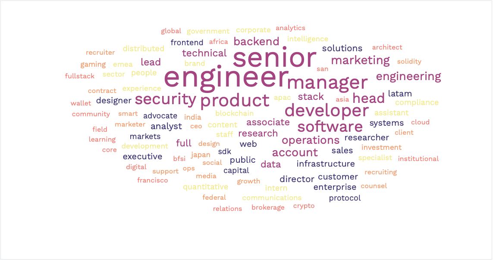

# Crypto Word Cloud

Crypto Word Cloud seeks to scrape popular web3 job sites to index the current jobs on the market.

In it's current iteration, it only scrapes _lever_ and _greenhouse_ job boards. Once collected, we can use the resulting job titles to make a word cloud of jobs available in the space! We believe this is a powerful way to visually show that web3 companies are not only hiring shadowy-super-coders and weird ceos, instead almost every job title is needed.

In the future, we may expand this project to create an internal job scraper for the Badger Blockchain club. More forthcoming.

# Getting Started

1. Clone this repo to your local machine. All development was done on MacOS.
2. Download [Selenium Browser Drivers](https://www.selenium.dev/documentation/webdriver/getting_started/install_drivers/).
   - make sure your chrome versions match, or it will ruin everything
3. Run `pip install -r /path/to/requirements.txt` to get all the packages you may need.

## Updating Config File

Companies scraped are taken from the `config.yaml`, which has the following format:

```yaml
- name: Certik
  keywords: []
  job-posting-tag: lever
  job-board-type: h5
  url: https://jobs.lever.co/certik/
```

Currently, we are scraping 16 job boards.

# Troubleshoot

After long periods of inactivity, the ChromeDriver may be out of date. You can use the following cmd to update it: `brew reinstall --cask chromedriver`. Them, check the version with `chromedriver -v`. If you are on Mac, it will most likely be blocked. Go to System Preferences -> Security & Privacy and **allow** chromedriver.

# The Word Cloud

The word cloud was generated using the [Free Word Cloud Generator](https://www.freewordcloudgenerator.com/generatewordcloud)



What does this show us? Well, engineering is the largest job title, which was expected. However, it also shows that the talent needed in web3 is vast - not just coders!
